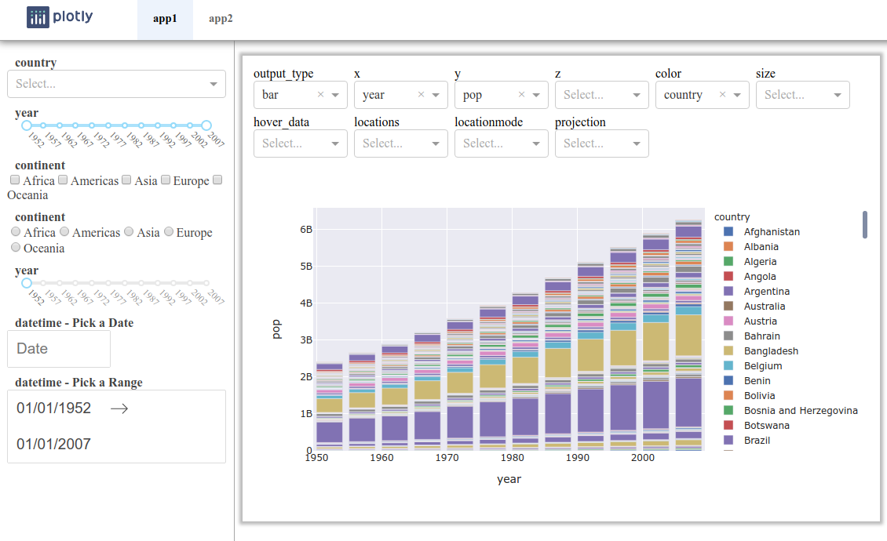
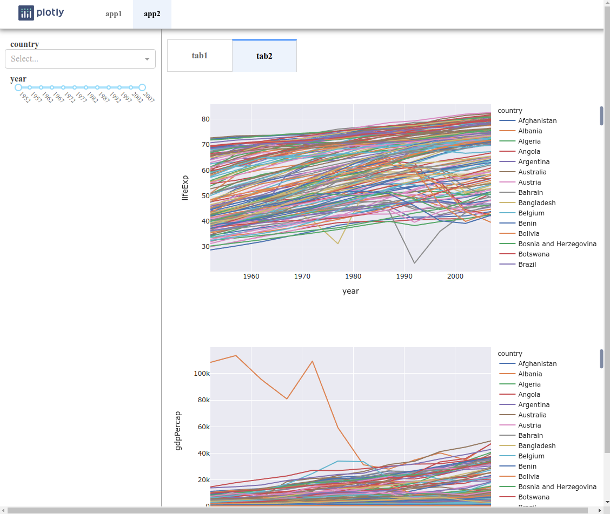

# turbo_dash
automated Dash framework with templates

## Quickstart
`pip install turbo-dash`

## Usage
- Multi Page App:
  - `./app.py` - initialize the app and server
  - `./index.py` - callback for page content Div (run this file to run the app)
  - `./apps/homepage.py` - homepage layout and callback
  - `./apps/app1.py` - app1 layout and callback
  - `./apps/app2.py` - app2 layout and callback
  - `./apps/fourohfour.py` - fourohfour layout and callback

## Example App
app1:

app2:

## Important Things to Know
- `turbo_dash` class:
  - Properties to call in each app:
    - `turbo_dash.layout`: create the app's layout
    - `turbo_dash.callbacks`: reference the app's callback function(s)
  - Creating a `turbo_dash` instance:
    - Include your inputs and outputs
      - If you want tabbed outputs, like in `app2.py`, separate you output lists into a `dict`. Use an `OrderedDict` if you want to preserve the tab order.
    - Pick which layout template you want to use
    - Include information about your header, if you want it
- `TurboInput` class:
  - Creating a `TurboInput` instance:
    - Include a list of outputs this input affects
    - Pick which input you want to use (check the source code for the most up to date list)
    - Include the dataframe and columns relevant to this input
    - Include the list of properties for this input (usually ['value'], but can be ['start_date', 'end_date'] for date ranges)
    - Include a list of functions that will manipulate the dataframe based on the list of properties
- `TurboOutput` class:
  - Creating a `TurboOutput` class:
    - Pick the `output_component_id` and `output_type` (i.e. what type of chart you want to output)
    - Pass the dataframe and relevant plotting arguments (e.g. `x`, `y`, `color`, etc)
    - Include the list of `TurboInput`s that will affect this output
    - If you want inputs where you can manipulate the output, like in `app1`, include the `graph_input_list` parameter.