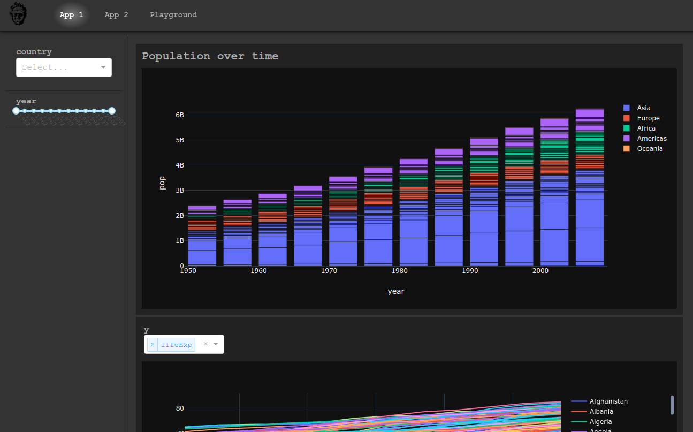

# turbo_dash
automated Dash framework with templates

## Quickstart
`pip install turbo-dash`

## Goal
The goal of the `turbo_dash` project is to create a wrapper for [plotly dash](https://plotly.com/dash/) that allows an 
inexperienced python developer to quickly create a simple, clean, interactive, easy to manipulate dashboard.

## OKRs
<table>
    <tbody>
        <tr>
            <th>Objectives</th>
            <th>Key Results</th>
            <th>Status</th>
        </tr>
        <tr>
            <td rowspan="3">
                1. `turbo_dash` requires minimal python, plotly, or dash knowledge to create a fully functional 
                dashboard, as measured by:
            </td>
            <td>i. less than 10 lines of code required per object</td>
            <td>grey</td>
        </tr>
        <tr>
            <td>ii. full documentation with examples for every developer-facing object</td>
            <td>grey</td>
        </tr>
        <tr>
            <td>iii. a suite of user-friendly templates that design the layout for the developer</td>
            <td>grey</td>
        </tr>
        <tr>
            <td>
                2. `turbo_dash` executes commands quickly and displays minimal lag between 
                input and output, as measured by:
            </td>
            <td>i. less than 1s load times for datasets up to 1M rows on a standard laptop CPU</td>
            <td>grey</td>
        </tr>
        <tr>
            <td rowspan="2">3. `turbo_dash` doesn't break, as measured by:</td>
            <td>i. comprehensive test suite</td>
            <td>grey</td>
        </tr>
        <tr>
            <td>ii. full type-hinting with no errors shown by `mypy`</td>
            <td>grey</td>
        </tr>
    </tbody>
</table>

## Example app
`./app.py`
```python
import turbo_dash

# grab our data
df = turbo_dash.data.gapminder()

# Here's where all the magic happens. This creates our dashboard.
turbo_dashboard = turbo_dash.turbo_dashboard(
    # template
    template='turbo-dark',

    # dashboard pages
    dashboard_page_list=[
        # App 1
        turbo_dash.turbo_dashboard_page(
            # page information
            url='/app1',
            name='App 1',

            # data
            df=df,  # setting our data at the page level allows us to use different datasets for each page

            # menu filters, i.e. dropdown, slider, etc
            menu_filter_list=[
                turbo_dash.turbo_filter(filter_type='Dropdown-multi', column='country'),
                turbo_dash.turbo_filter(filter_type='RangeSlider', column='year'),
            ],

            # outputs, i.e. graphs, images, etc
            output_list=[
                # bar graph of population vs year
                turbo_dash.turbo_output(
                    output_type='bar',
                    x='year',
                    y='pop',
                    color='continent',
                    hover_name='country',
                ),

                # line graph of life expectancy vs year with an input to change the y axis to a different column
                turbo_dash.turbo_output(
                    output_type='line',
                    x='year',
                    y='lifeExp',
                    color='country',
                    chart_input_list=['y'],
                ),
            ],
        ),

        # App 2
        turbo_dash.turbo_dashboard_page(
            # page information
            url='/app2',
            name='App 2',

            # data
            df=df,  # setting our data at the page level allows us to use different datasets for each page

            # menu filters, i.e. dropdown, slider, etc
            menu_filter_list=[
                turbo_dash.turbo_filter(filter_type='Checklist', column='continent'),
            ],

            # outputs, i.e. graphs, images, etc
            output_list=[
                # line graph of gdpPercap vs year
                turbo_dash.turbo_output(
                    output_type='line',
                    x='year',
                    y='gdpPercap',
                    color='country',
                ),
            ],
        ),

        # Playground
        turbo_dash.turbo_dashboard_page(
            # page information
            url='/playground',
            name='Playground',

            # data
            df=df,  # setting our data at the page level allows us to use different datasets for each page

            # menu filters, i.e. dropdown, slider, etc
            menu_filter_list=[
                turbo_dash.turbo_filter(filter_type='Checklist', column='continent'),
                turbo_dash.turbo_filter(filter_type='Dropdown-multi', column='country'),
                turbo_dash.turbo_filter(filter_type='RangeSlider', column='year'),
            ],

            # outputs, i.e. graphs, images, etc
            output_list=[
                # line graph of gdpPercap vs year
                turbo_dash.turbo_output(
                    output_type='line',
                    x='year',
                    y='gdpPercap',
                    color='country',
                    chart_input_list=[
                        'output_type',
                        'x',
                        'y',
                        'z',
                        'color',
                        'size',
                        'hover_name',
                        'hover_data',
                        'locations',
                        'locationmode',
                        'projection',
                    ],
                ),
            ],
        ),

    ],
)

# Execute the code in a development environment. For deploying in production, see the "Deploying in Production" 
#   section of the README here: https://github.com/turbo3136/turbo_dash/blob/master/README.md
if __name__ == '__main__':
    server = turbo_dashboard.run_dashboard(app_name=__name__)
```

## Screenshots
app1:


playground:


## Deploying in Production
[Official Dash reference](https://dash.plotly.com/deployment)

#### What I did (probably unstable and stupid):
[Combining Flask, Gunicorn, and Docker reference](https://testdriven.io/blog/dockerizing-flask-with-postgres-gunicorn-and-nginx/)
1. Follow that guide above, kind of. Our strategy is going to be using 
    1. Docker to create a container that keeps our code nice and tidy
    1. Gunicorn to create the WSGI HTTP server (sure, I know some of these words)
1. Create the files and structure you see in the `services` directory
    1. Notice that the `project/__init__.py` file contains your dashboard code
        1. Also notice that you can still use the Dash functionality that automatically
        imports CSS from the `assets` directory
        1. You can also use the `static` directory to save any content you want to display
        like the homepage image, logo, or 404 page. Just add an argument for those files
        when you create the `turbo_dash.turbo_dashboard()` instance
    1. Everything else is docker and flask stuff in service of making that code run
1. You'll also need the `docker-compose.yml` and `docker-compose.prod.yml` files that create your docker image
1. And you'll need the `.env.dev` and `.env.prod` files that the docker compose files pull from
1. Good luck! If you're reading this doc, there's at least an 80% chance you know more
than I do, so there's no point in asking me why I did X.
